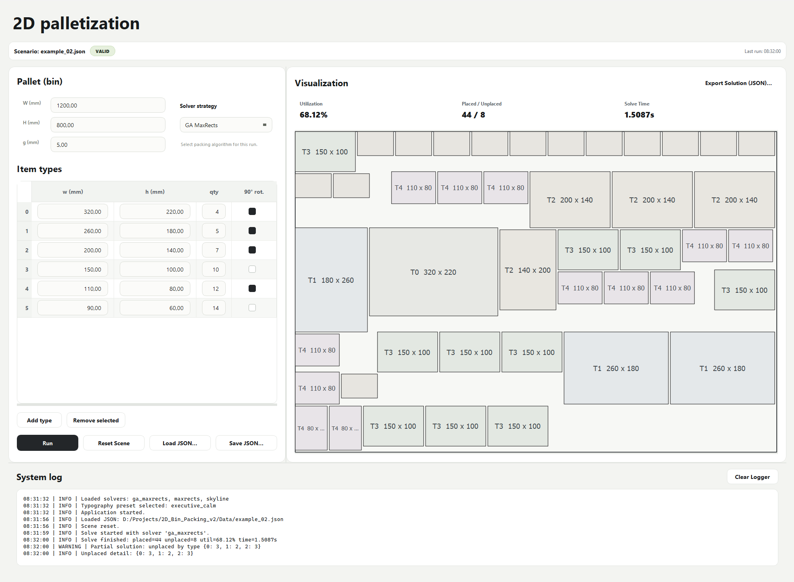

# 2D Single-Bin Packing (PyQt5)

Desktop application for **2D single-bin / pallet packing** with a modular **GUI** (`App/`) and **algorithmic core** (`src/`). Targets industrial-style benchmarks: validation, logging, reproducible setup, and tests.



*(Replace `images/gui_screenshot.png` with a capture of your running application.)*

## Problem

- One bin (pallet) of size **W × H** (mm).
- Item types **i**: footprint **wᵢ × hᵢ**, quantity **qᵢ**, optional **90° rotation**.
- **Minimum gap g** between any two placed items (no required gap to the bin border).
- **No overlap** between items; all items must lie inside the bin.
- **Optimization (lexicographic)**:
  1. Maximize the number of placed pieces.
  2. Among ties, minimize unused area \(W \cdot H - \sum \text{placed area}\).

If not everything fits, the solver returns a **valid partial** layout and **unplaced counts** per type.

## Requirements

- **Python** 3.10+
- **PyQt5** (GUI)
- **pytest** (tests, optional for end users)

## Installation

### Option A: pip (quick)

```bash
conda activate 2d-bin-packing
pip install -r requirements.txt
```

### Option B: Conda (scripts from benchmark spec)

- **Windows**: run `install.bat` (creates env `2d-bin-packing`, installs dependencies).
- **Linux/macOS**: `chmod +x install.sh && ./install.sh`

Then activate the environment and verify:

```bash
python verify.py
```

## Run

From the repository root (so `App` and `src` resolve on `sys.path`):

```bash
python -m App.main
```

## Project layout

| Path | Role |
|------|------|
| `App/` | PyQt5 entry point, main window, widgets, `QGraphicsView` / scene, worker thread |
| `src/` | Domain models, geometry (gap / overlap), validation, solver, JSON I/O — **no Qt** |
| `Data/` | Sample JSON instances (`sample_instances/`) |
| `Example/` | Headless batch solve (`run_batch.py`) |
| `Tests/` | Unit tests for geometry, validation, solver, smoke import |
| `images/` | README screenshot assets |

## Algorithms

- **Default solver (`ga_maxrects`):** a deterministic **genetic algorithm (GA)** in `src/solver/ga_solver/solver.py` evolves piece order permutations and decodes each individual via the existing **MaxRects** placement engine. Objective is benchmark-aligned and strictly lexicographic: maximize placed count first, then minimize unused area.
- **Decoder / baseline (`maxrects`):** bottom-left placement on **maximal free rectangles**. Free space is tracked as disjoint axis-aligned rectangles; each placed footprint is subtracted from free regions. Multiple deterministic orderings are still available and used as seeds/fallback.
- **Legacy (`skyline`):** `SkylineSolver` remains available for comparison.
- **Determinism:** GA uses a seedable RNG (`random.Random(seed)`, default seed `42`). Same input + same seed yields the same output layout.
- **Robustness:** GA is a metaheuristic layer only. On any internal GA failure, solver automatically falls back to deterministic MaxRects and still returns a valid (possibly partial) solution.
- **Gap handling:** Euclidean **minimum distance** between item footprints must be ≥ **g**; for **g = 0**, edge/corner contact is allowed but **positive-area overlap** is forbidden.

**Trade-off:** GA usually finds denser layouts than single-order heuristics under the same time budget, but does not guarantee a global optimum.

## JSON configuration

Files follow `schema_version: 1`.

```json
{
  "schema_version": 1,
  "bin": {
    "W": 1200,
    "H": 800,
    "g": 5
  },
  "items": [
    { "id": 0, "w": 300, "h": 200, "q": 3, "rotation": true }
  ]
}
```

- **W**, **H**: bin dimensions (mm).  
- **g**: minimum distance between items (mm).  
- **items**: each row has **w**, **h**, **q** (quantity), **rotation** (allow 90° swap), **id** (type id, optional; defaults to row index).

Load/save from the GUI via **Load JSON…** / **Save JSON…**.

## Tests

```bash
python -m pytest Tests
```

## Architecture notes

- **Separation:** `PackingProblem` / `PackingSolution` DTOs cross the GUI boundary; the worker runs `solve()` off the UI thread.
- **Logging:** Python `logging` with a Qt-safe bridge to the **System log** panel.
- **Visualization:** `QGraphicsScene` / `QGraphicsView` with technical-drawing style outlines and optional in-box dimension labels for large pieces.

## License

See `LICENSE` in the repository.
